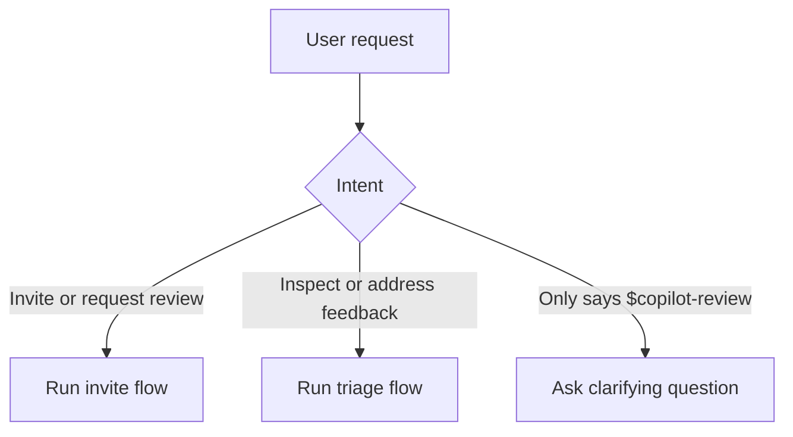

# copilot-review

`copilot-review` is a Codex skill for two common GitHub Copilot review tasks on a pull request:

- ask Copilot to review the PR
- read Copilot's latest review and address the useful feedback

This repository is intended to be installed into Codex directly from GitHub.

## GitHub Install

Install with:

```text
npx skills install https://github.com/Ma233/copilot-review
```

After installation, restart Codex to pick up the new skill.

## How Users Should Use It

The primary interface should be natural language, not memorized commands.

Typical user requests:

- `invite copilot review on this pr`
- `request a copilot review`
- `check the latest copilot review`
- `summarize copilot review comments`
- `address copilot review feedback`
- `fix the issues from copilot review`

What the skill should do:

- If the user asks to request or invite a review, the skill should run the invite flow.
- If the user asks to inspect, summarize, triage, fix, or address feedback, the skill should run the triage flow.
- If the user explicitly writes `$copilot-review` with no extra intent, the skill should ask what they want to do instead of guessing.

Explicit forms are optional, but supported:

- `$copilot-review:invite`
- `$copilot-review:triage`
- `$copilot-review`



Recommended follow-up:

- `Do you want to invite Copilot review, or triage the latest Copilot review feedback?`

## User Outcomes

### Invite Flow

Best when the user wants Copilot to start reviewing the PR.

Expected result:

- find the current branch's open PR
- run `gh pr edit --add-reviewer @copilot`
- report that Copilot was requested

### Triage Flow

Best when the user wants to understand or act on Copilot feedback.

Expected result:

- fetch the latest Copilot-authored review on the PR
- classify comments as `apply`, `verify`, or `ignore`
- implement `apply` items when the user asked for improvements
- reply with a short summary instead of dumping raw review JSON

## Agent Behavior

This skill is for action, not display.

For triage requests, Codex should normally:

1. Fetch the latest Copilot review.
2. Use `templates/triage_prompt.md`.
3. Merge duplicate comments.
4. Reject stale, weak, or incorrect feedback.
5. Apply valid fixes if the user asked for code improvements.
6. Reply with a short summary of applied, verified, and ignored items.

## Runtime Layout

The bundled runtime scripts are:

```bash
scripts/copilot_review.sh
scripts/invite_copilot_reviewer.sh
scripts/get_latest_copilot_review.sh
```

The bundled compact decision template is:

```bash
templates/triage_prompt.md
```

Codex should resolve these paths from the installed skill root, not from the user's current working directory.

## Dependencies

System command dependencies:

- `sh`: required to run the script
- `gh`: required, used to query GitHub repository, pull request, review, and review comment data
- `jq`: required, used to filter and shape GitHub API JSON responses
- `git`: conditionally required when the script needs to infer the current branch or resolve branch remote information from the local checkout

Authentication requirements:

- `gh` must already be installed and authenticated
- the caller must have access to the target GitHub repository and pull request metadata
- when using private repositories during GitHub-based installation, Codex's installer may rely on existing git credentials or `GITHUB_TOKEN` / `GH_TOKEN`

## Script Behavior

Unified entrypoint:

- `scripts/copilot_review.sh invite`
- `scripts/copilot_review.sh triage`

The entrypoint requires an explicit subcommand. It does not guess.

Invite script:

1. Resolves the target branch, defaulting to the current git branch.
2. Finds the open pull request associated with that branch.
3. Runs `gh pr edit --add-reviewer @copilot`.
4. Prints a single JSON object describing the request.

Triage script:

1. Resolves the target branch, defaulting to the current git branch.
2. Resolves the target repository, defaulting to the current GitHub repository when possible.
3. Finds the pull request associated with that branch.
4. Fetches all reviews for that pull request.
5. Selects the latest review whose author login contains `copilot`.
6. Fetches comments attached to that review.
7. Prints a single JSON object.

Use the unified entrypoint for invite mode:

```bash
SKILL_ROOT="<absolute-path-to-installed-copilot-review-skill>"
ENTRYPOINT_PATH="$SKILL_ROOT/scripts/copilot_review.sh"
"$ENTRYPOINT_PATH" invite
```

Use the unified entrypoint for triage mode:

```bash
"$ENTRYPOINT_PATH" triage
```

Use a specific branch:

```bash
"$ENTRYPOINT_PATH" triage --branch feature/my-branch
```

Use a specific repository and branch:

```bash
"$ENTRYPOINT_PATH" triage --repo owner/repo --branch feature/my-branch
```

## Output

Invite mode prints one JSON object with:

- `pull_request`: PR metadata such as number, URL, title, and head branch
- `requested_reviewer`: always `@copilot`
- `status`: request status

Triage mode prints one JSON object with:

- `pull_request`: PR metadata such as number, URL, title, and head branch
- `review`: the latest Copilot-authored review, including body, state, submitted time, inline comments, and both GitHub review ids

If no matching pull request exists, or if no Copilot review exists for that PR in triage mode, the corresponding script exits non-zero and writes an error message to stderr.
