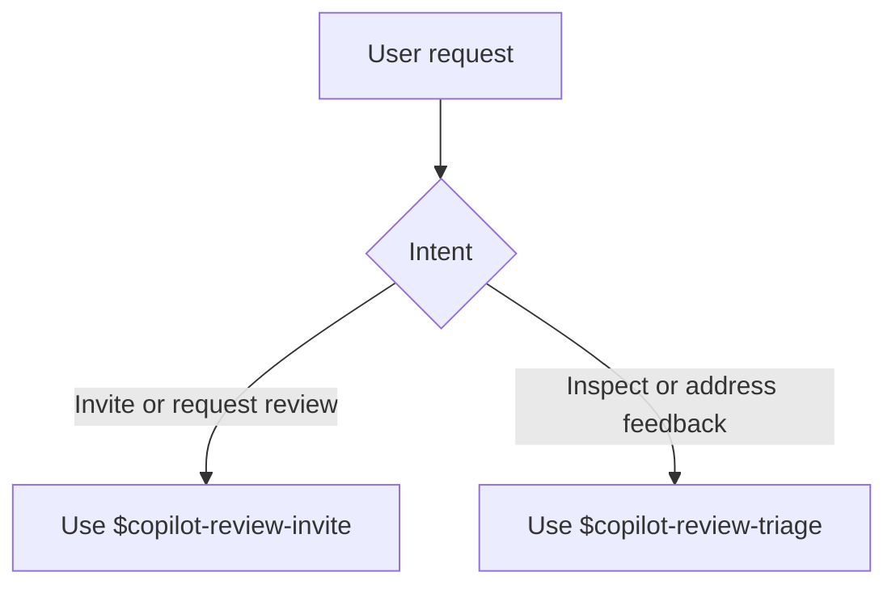

# copilot-review

Two Codex skills for GitHub Copilot pull request review workflows:

- `$copilot-review-invite`: ask Copilot to review the PR
- `$copilot-review-triage`: read Copilot's latest review and address the useful feedback

## GitHub Install

```text
npx skills install -a codex https://github.com/Ma233/copilot-review
```

Restart Codex after installation.



## Usage

Use `$copilot-review-invite` for requests like:

- `invite copilot review on this pr`
- `request a copilot review`

Use `$copilot-review-triage` for requests like:

- `check the latest copilot review`
- `summarize copilot review comments`
- `fix the issues from copilot review`

## Runtime

- `scripts/invite_copilot_reviewer.sh`
- `scripts/get_latest_copilot_review.sh`
- `templates/triage_prompt.md`

## Dependencies

- `sh`
- `gh`
- `jq`
- `git` when branch or repo inference is needed

`gh` must already be authenticated and have access to the target repository.
