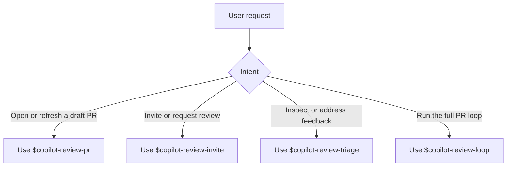

# copilot-review

Four Codex skills for GitHub Copilot pull request review workflows:

- `$copilot-review-pr`: commit and push the current work when needed, then create or reuse a draft PR
- `$copilot-review-invite`: ask Copilot to review the PR
- `$copilot-review-triage`: read Copilot's latest review and address the useful feedback
- `$copilot-review-loop`: run an autonomous draft PR and Copilot review loop

## GitHub Install

```text
npx skills install -a codex https://github.com/Ma233/copilot-review
```

Restart Codex after installation.



## Usage

Use `$copilot-review-pr` for requests like:

- `create a draft pr for this branch`
- `open or reuse the pr before review`
- `prepare this branch with a draft pr against main`
- `commit my current changes, push the branch, and open a draft pr`

Use `$copilot-review-invite` for requests like:

- `invite copilot review on this pr`
- `request a copilot review`

Use `$copilot-review-triage` for requests like:

- `check the latest copilot review`
- `summarize copilot review comments`
- `fix the issues from copilot review`

Use `$copilot-review-loop` for requests like:

- `start the copilot review loop for this branch`
- `create a draft pr and keep addressing copilot review`
- `run the autonomous PR loop with 4 rounds`

## Runtime

- `copilot-review-invite/scripts/invite_copilot_reviewer.sh`
- `copilot-review-pr/scripts/create_or_reuse_draft_pr.sh`
- `copilot-review-triage/scripts/get_latest_copilot_review.sh`
- `copilot-review-triage/templates/triage_prompt.md`
- `copilot-review-loop/scripts/create_or_reuse_draft_pr.sh`
- `copilot-review-loop/scripts/invite_copilot_reviewer.sh`
- `copilot-review-loop/scripts/get_latest_copilot_review.sh`
- `copilot-review-loop/scripts/run_copilot_review_loop.sh`
- `copilot-review-loop/templates/triage_prompt.md`
- `copilot-review-loop/templates/triage_schema.json`

## Loop Behavior

`$copilot-review-loop` can:

- commit all local changes
- push the branch
- create or reuse a draft PR through `$copilot-review-pr`
- invite `@copilot` to review
- poll for the latest Copilot review
- call `codex exec` to apply useful feedback
- commit, push, and invite Copilot again
- stop when there are no comments, the max round count is reached, review value is exhausted, degraded review churn is detected, or human intervention is needed

## Loop Stop Policy

`$copilot-review-loop` optimizes for high-value review convergence, not for driving Copilot to zero comments at any cost.

- It keeps full round and review history on disk for auditing.
- It feeds Codex a recent structured context window instead of the full raw review history.
- It becomes less tolerant of polish-only or repetitive review comments as rounds increase.
- It can stop early when recent rounds show repeated themes, low novelty, or no meaningful applied changes.
- When it stops for degradation, it records human-readable reasons so the developer can see why automation handed off.

## Dependencies

- `sh`
- `gh`
- `jq`
- `git` when branch or repo inference is needed
- `codex` for the autonomous loop

`gh` must already be authenticated and have access to the target repository.
